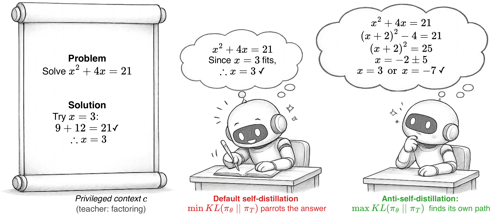
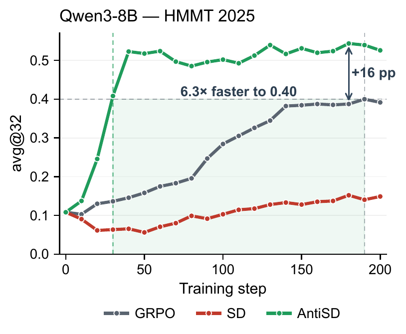
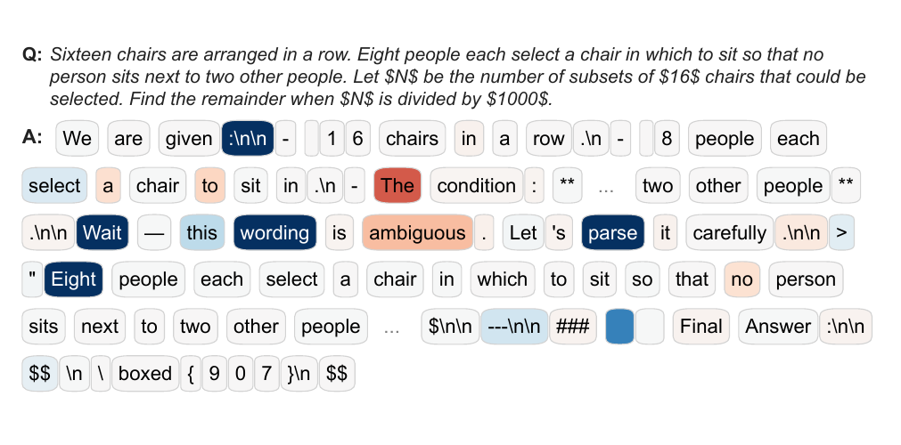
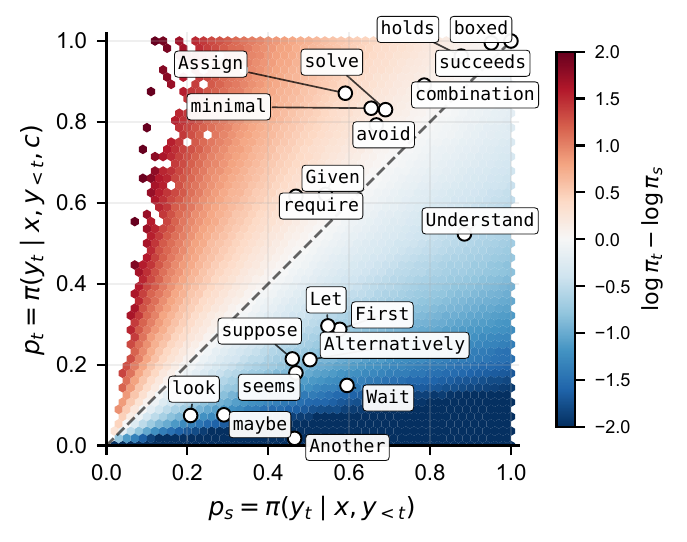
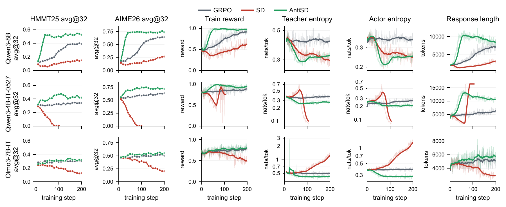
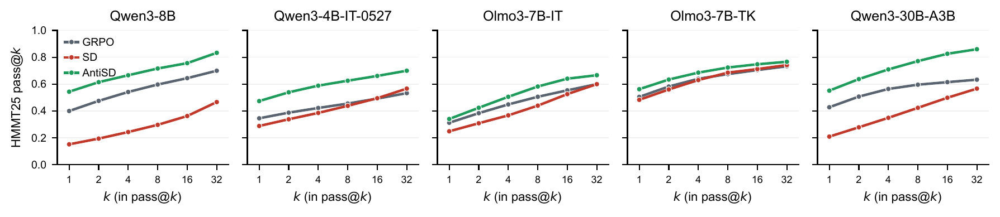

<div align="center">

# AntiSD: Anti-Self-Distillation for Reasoning RL via Pointwise Mutual Information

[](https://www.alphaxiv.org/abs/2605.11609) [](https://github.com/FloyedShen/AntiSD) [](https://wandb.ai/brain-cog/AntiSD)

</div>

<div align="center">
  <p>
    <a href="#-overview">📖 Overview</a> •
    <a href="#-main-results">📊 Main Results</a> •
    <a href="#-getting-started">🚀 Getting Started</a> •
    <a href="#-citation">📝 Citation</a>
  </p>
</div>

## 📖 Overview

On-policy self-distillation pulls a student toward a copy of itself conditioned on **privileged context** — a verified solution or environment feedback. On math reasoning the gains are inconsistent: the privileged context turns the teacher into an oracle that is confident on tokens already implied by the answer (structural connectives, verifiable claims) and unsure on the **deliberation tokens** — *Wait*, *Let*, *Maybe* — that drive multi-step search. Standard self-distillation descends a divergence from this oracle, reinforcing template tokens and weakening the deliberation tokens that actually do the work.

**AntiSD inverts the direction**: it ascends a bounded Jensen–Shannon divergence between student and teacher rather than descending it, with an entropy-triggered gate that disables the term once the teacher's per-token entropy collapses. The pointwise mutual information characterization in the paper gives a per-step account of why this works.

<p align="center">
  
  &nbsp;
  
</p>

*An oracle-conditioned teacher biases the student toward a single root; reversing the signal preserves deliberation and recovers the rest. **(Right)** Qwen3-8B on HMMT 2025: AntiSD reaches GRPO's peak in ~1/5 the steps and ends +15\,pp higher; default self-distillation underperforms GRPO.*

<p align="center">
  
  &nbsp;
  
</p>

*Per-token signal $u_t = t_t - s_t$ on Qwen3-4B-IT-2507 at AIME 2025. **(Left)** Single-rollout trace. **(Right)** $(\pi_S, \pi_T)$ heatmap. Blue marks deliberation tokens ($u_t \ll 0$); red marks shortcut tokens ($u_t \gg 0$).*

## 📊 Main Results

Across five language models from 4B to 30B parameters on math reasoning benchmarks (AIME 2024 / 2025, HMMT 2025, BeyondAIME), AntiSD reaches the GRPO baseline's accuracy in **2 to 10× fewer training steps** and improves final accuracy by up to **11.5 points**.

<p align="center">
  
</p>

*Training dynamics on three models (rows) along six axes (columns). Faded traces are raw values; bold traces are 20-step rolling means. AntiSD remains in a stable middle band on all three models, while default SD's teacher and actor entropy collapse (Qwen3-4B-IT-2507) or inflate (Olmo3-7B-IT) — the bidirectional failure mode that the sign reversal addresses.*

<p align="center">
  
</p>

*HMMT 2025 pass@k at each row's peak-mean snapshot. AntiSD's lead over GRPO is sustained across k — the gain reflects expanded coverage, not just variance reduction.*


## 🚀 Getting Started

The core AntiSD loss kernel is in [verl/workers/actor/dp_actor.py](verl/workers/actor/dp_actor.py) (the `grpo_ca` branch). Training scripts are under [recipe/antisd/run/](recipe/antisd/run/), organized as `run/<model>/<method>.sh`.

**1. Install** — follow the [veRL documentation](https://verl.readthedocs.io/en/latest/start/install.html) to set up the environment.

**2. Prepare data**

```bash
bash data/prepare_antisd.sh
```

**3. Train**

```bash
bash recipe/antisd/run/qwen3-8b/antisd.sh         # AntiSD (ours)
bash recipe/antisd/run/qwen3-8b/sd.sh             # default Self-Distillation
bash recipe/antisd/run/qwen3-8b/grpo.sh           # GRPO baseline
```

The same three commands are available for `qwen3-4b/`, `qwen3-4b-inst/`,
`olmo3-instruct/`, and `olmo3-think/` (32k thinking-mode context). See
[recipe/antisd/README.md](recipe/antisd/README.md) for env-var knobs and
multi-node instructions.


## 📝 Citation

If you find this work useful, please consider citing:

```bibtex
@misc{shen2026antiselfdistillationreasoningrlpointwise,
      title={Anti-Self-Distillation for Reasoning RL via Pointwise Mutual Information},
      author={Guobin Shen and Xiang Cheng and Chenxiao Zhao and Lei Huang and Jindong Li and Dongcheng Zhao and Xing Yu},
      year={2026},
      eprint={2605.11609},
      archivePrefix={arXiv},
      primaryClass={cs.LG},
      url={https://arxiv.org/abs/2605.11609},
}
```

## Attribution

Our implementation is based on a recent version of [veRL](https://github.com/volcengine/verl). See [NOTICE](NOTICE) for the full list of files we extended.
